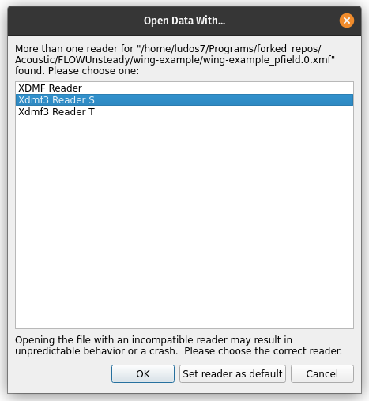
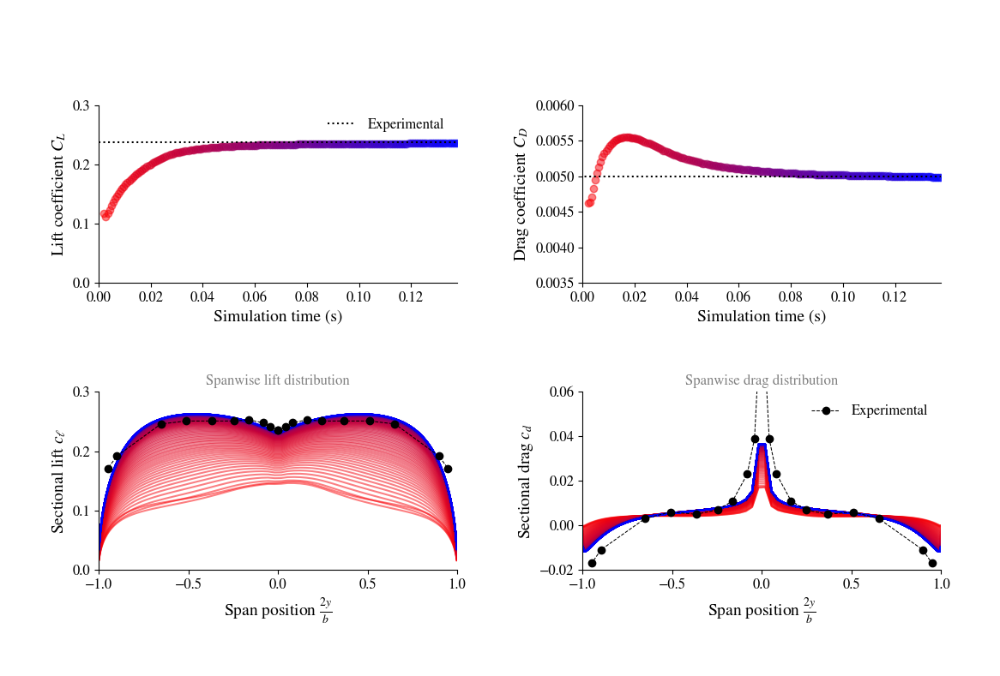

# julia2know

## installation

https://julialang.org/downloads/platform/

Use juliaup, the package manager for julia.

https://github.com/JuliaLang/juliaup#mac-and-linux

    curl -fsSL https://install.julialang.org | sh

Chose yes to proceed to installation.

Then source ~/.bashrc and julia is installed.

juliaup list

julia --version

## basic usage

Run julia with the command `julia`

Exit with `exit()`

### install package

run julia and press `]` to enter the package manager.
The prompt will change to the current vesion and pkg>, for example:

    (@v1.11) pkg>
Then add a package as follows:

add package_name

Ex:

    add FFTW

## some examples

see examples folder

### WAV

install WAV

Run: julia wav_package.jl
https://github.com/dancasimiro/WAV.jl
generates waveform data for a one second long 1 kHz sine tone, at a sampling frequency of 8 kHz, 
writes it to a WAV file and then reads the data back. It then appends a 2 kHz tone to the same file and plays the result.

# Large code base notes

## FLOWUnsteady

Doc:
https://flow.byu.edu/FLOWUnsteady/installation/general/

Install paraview, see install notes.

sudo ln -s /home/ludos7/ParaView/ParaView-5.13.3-MPI-Linux-Python3.10-x86_64/bin/paraview /usr/local/bin/paraview

sudo apt install libcminpack1 mpich

### Install OpenVSP

Download from here:
https://openvsp.org/download.php

(to ~/Downloads, for example)

    sudo dpkg -i OpenVSP-3.43.0-Ubuntu-22.04_amd64.deb
### PyCAll

Small note about python matplotlib

When I import matplotlib.pyplot I have the following warning:

Unable to import Axes3D - Multiple Matplotlib Versions Installed

This is due to the fact that 2 versions of Matplotlib are installed on my system for the same python executable, one installed by pip with --user option and the other with apt install.

Check which matplotlib is being used:

    python3.10 -c "import matplotlib; print(matplotlib.__file__)"

I got this:

    ~/.local/lib/python3.10/site-packages/matplotlib/__init__.py

So the pip installed local version is called. It was recommended then to remove the other one, which I tried:

    sudo apt remove python3-matplotlib

It turned out that one was installed for ros2, in particular ros-humble-desktop, so removing apt manage python3-matplotlib also removed ros-humble-desktop.

So I reinstalled it:

    sudo apt install ros-humble-desktop

And used a virtual environment python Ardupilot, within which matplotlib call don't return any error.

So in the julia REPL:

    # Install PyCall
    import Pkg; Pkg.add("PyCall")

    ENV["PYTHON"] = "~/.virtualenvs/Ardupilot/bin/python"

    # if ~ doesn't work then use the whole path, i used the later. 

    # Rebuild PyCall
    Pkg.build("PyCall")

Then close and reopen the Julia REPL, and run:

    import PyCall
    PyCall.pyversion

It gave me: 

    v"3.10.12"

In the Same virtual environment install mpmath scipy,

    pip install mpmath scipy 

verify that matplotlib uses the Qt5Agg backend:

    import matplotlib
    print(matplotlib.get_backend())

I got ... tkagg.

So let's set it to use qt5:

If a different backend is reported, it can be changed either by setting matplotlib.rcParams['backend'] before importing matplotlib.pyplot, setting the MPLBACKEND environment variable, or using the matplotlib.use() function

    print(matplotlib.matplotlib_fname())

Got:

    ~/.virtualenvs/Ardupilot/lib/python3.10/site-packages/matplotlib/mpl-data/matplotlibrc

I installed pyqt5 with pip and checking the backend again returned qtagg, so no need to modify anything else.

Otherwise, do:

open the `matplotlibrc` file and add the line `backend: Qt5Agg`.
It's important to ensure that PyQt5 or PySide2 is installed in the environment for the Qt5Agg backend to function correctly.

    cd2forkr
    cd Acoustic/
    git clone git@github.com:byuflowlab/FLOWExaFMM.jl.git
    cd FLOWExaFMM.jl/
    bash build.sh

    Compile Summary:
    julia version 1.11.5
    CxxWrap v0.15.0 Info Packages marked with ⌃ have new versions available and may be upgradable. nothing

This generated the file `fmm.so` under `src/`.

Add FLOWExaFMM:

    # In the Julia REPL
    ] develop path/to/FLOWExaFMM
    # for me: ~/Programs/forked_repos/Acoustic/FLOWExaFMM.jl

[Optional] Test FLOWExaFMM:

    ] test FLOWExaFMM

Test passed .

Add FLOWVPM:

    ] add https://github.com/byuflowlab/FLOWVPM.jl

[Optional] Test FLOWVPM:

    ] test FLOWVPM

Test is several minutes, results in:

    Vortex stretching + Classic VPM test: Thick Leapfrog...
        Running simulation...
        Computing analytic solution...
        Leapfrog end state verification
                           Centroid 1 Centroid 2  Radius 1  Radius 2
                  Analytic     4.964     5.750     0.766     0.814
                       VPM     4.858     5.636     0.774     0.802
                     ERROR   -2.142﹪   -1.989﹪   0.956﹪  -1.441﹪
     Testing FLOWVPM tests passed

Add these packages:

    import Pkg

    url = "https://github.com/byuflowlab/"

    packages = [ ("AirfoilPrep.jl", "v2.1.2"), ("FLOWVLM", "v2.1.3"),
                 ("FLOWNoise", "v2.3.3"),      ("BPM.jl", "v2.0.1")  ]

    Pkg.add([ Pkg.PackageSpec(; url=url*name, rev=v) for (name, v) in packages ])

Then FLOWUnsteady:

    ] add https://github.com/byuflowlab/FLOWUnsteady

I tried the simple wing, will show two matplotlib figures, and then open paraview, i chose the default viewer for paraview as shown below.

    
    

And the other example, which takes quite some time to run.
18mn to be exact.
